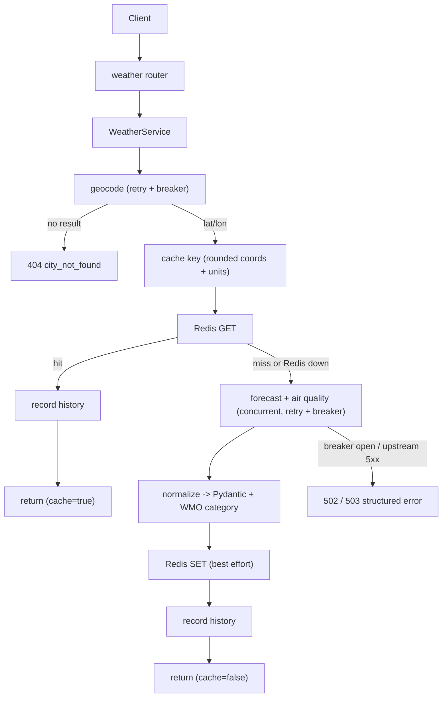

# Weather Proxy

A production-grade weather proxy over [Open-Meteo](https://open-meteo.com/). It
exposes a small REST API that resolves a city to coordinates, fetches forecast
and air-quality data, normalizes it into typed models, and serves it with a
Redis cache in front and MongoDB behind for durable favorites and search
history. Every upstream call is wrapped in retry plus a circuit breaker, every
request is structured-logged and correlated by request id, and the whole stack
comes up with a single command.

A polished dark editorial dashboard (Next.js + TypeScript + Tailwind v4) ships
alongside it (see [Frontend](#frontend)).

> Weather data by [Open-Meteo.com](https://open-meteo.com/), licensed
> [CC BY 4.0](https://creativecommons.org/licenses/by/4.0/). Open-Meteo requires
> no API key.

## Contents

- [Architecture](#architecture)
- [Request flow](#request-flow)
- [API](#api)
- [Quick start (Docker)](#quick-start-docker)
- [Local development (uv)](#local-development-uv)
- [Environment variables](#environment-variables)
- [Design decisions](#design-decisions)
- [Assumptions](#assumptions)
- [Testing and coverage](#testing-and-coverage)
- [What I would improve with more time](#what-i-would-improve-with-more-time)
- [Attribution](#attribution)

## Architecture

The backend is strictly layered. Dependencies point downward only:

```
routers  ->  services  ->  clients      (Open-Meteo, resilience)
                       ->  repositories  (Redis cache, MongoDB)
                       ->  domain/models (WMO map, units, normalization, schemas)
```

- Routers do no business logic; they validate input and delegate.
- Services orchestrate the flow (cache, upstreams, normalization, persistence).
- Clients own HTTP to upstreams and the retry plus circuit-breaker policy.
- Repositories own persistence: Redis is an ephemeral cache, MongoDB is the
  system of record. The two datastores are never mixed.
- Domain holds pure, I/O-free logic (the single-source WMO mapping, unit
  mapping and conversions, cache-key derivation, payload normalization).

## Request flow

`GET /weather?city=London&units=metric`



Notes:

- Redis failures never produce a 500. On a cache error the API logs a warning,
  bypasses the cache, and serves a live response. The `cache` flag reflects the
  outcome.
- Air quality is best-effort: a forecast failure fails the request, but an
  air-quality failure degrades to a response without the AQI panel.
- Transient upstream failures (timeouts, connection errors, 5xx) are retried
  with exponential backoff and jitter; 4xx is never retried. After repeated
  failures the per-upstream breaker opens and calls fail fast as a 503.

## API

| Method | Path | Description |
| --- | --- | --- |
| GET | `/weather?city={city}&units={metric\|imperial}` | Resolve a city, return normalized weather + air quality, record history. |
| GET | `/weather?lat={lat}&lon={lon}&units={...}` | Same, by coordinates (used by browser geolocation); skips geocoding. |
| GET | `/health` | Per-dependency health (Redis, Mongo, upstream) and breaker states. 200 healthy, 503 when a critical dependency is down. |
| GET | `/favorites` | List saved cities for the client. |
| POST | `/favorites` | Save a city (idempotent per resolved location). |
| DELETE | `/favorites/{id}` | Remove a saved city. |
| GET | `/history` | Recent searches for the client, deduplicated and capped. |

- Interactive OpenAPI docs are served at `/docs`.
- Favorites and history are scoped by an `X-Client-Id` header (a UUID). Requests
  without a valid client id get a clean `400`.
- Errors use a single envelope: `{ "error": { "code": ..., "message": ... } }`.
- Every response includes an `X-Request-Id` header for log correlation.

## Quick start (Docker)

Prerequisites: Docker and Docker Compose v2.

```bash
docker compose up --build
```

This starts MongoDB, Redis, the backend (with health-gated startup ordering),
and the Next.js frontend. Once up:

- Dashboard: http://localhost:3000
- API: http://localhost:8000
- Docs: http://localhost:8000/docs
- Health: http://localhost:8000/health

```bash
curl "http://localhost:8000/weather?city=London"
```

## Local development (uv)

Prerequisites: [uv](https://docs.astral.sh/uv/) (the target machine may not have
it; install with `curl -LsSf https://astral.sh/uv/install.sh | sh`). uv manages
the Python 3.13 toolchain and a locked virtual environment for you.

```bash
cd backend
uv sync                 # creates .venv from uv.lock and installs deps
uv run uvicorn app.main:app --reload
```

Redis and MongoDB are optional locally: with neither running, the cache simply
reports misses and history/favorites writes fail gracefully. To run them
quickly: `docker compose up redis mongo`.

### Frontend (Next.js)

Prerequisites: Node.js 22+.

```bash
cd frontend
npm install
cp .env.example .env.local   # point NEXT_PUBLIC_API_BASE_URL at the backend
npm run dev                  # http://localhost:3000
```

`npm run lint`, `npm run typecheck`, and `npm run build` mirror the CI checks.

## Environment variables

All configuration is environment-driven (see `.env.example`). Defaults are safe
for local use; `docker-compose.yml` wires the in-network hostnames.

| Variable | Default | Description |
| --- | --- | --- |
| `APP_ENV` | `dev` | `dev` (console logs) or `prod` (JSON logs). |
| `LOG_LEVEL` | `INFO` | Log level. |
| `CORS_ORIGINS` | `http://localhost:3000` | Comma-separated allowed origins. |
| `REDIS_URL` | `redis://localhost:6379/0` | Redis connection URL. |
| `CACHE_TTL_SECONDS` | `600` | Cache TTL for weather responses. |
| `CACHE_COORD_PRECISION` | `2` | Decimal places coordinates are rounded to for cache keys. |
| `MONGO_URL` | `mongodb://localhost:27017` | MongoDB connection URL. |
| `MONGO_DB_NAME` | `weather` | Database name. |
| `HISTORY_MAX_ITEMS` | `20` | Max history entries kept per client. |
| `GEOCODING_BASE_URL` | Open-Meteo geocoding | Geocoding endpoint. |
| `FORECAST_BASE_URL` | Open-Meteo forecast | Forecast endpoint. |
| `AIR_QUALITY_BASE_URL` | Open-Meteo air quality | Air-quality endpoint. |
| `HTTP_CONNECT_TIMEOUT` | `3.0` | httpx connect timeout (s). |
| `HTTP_READ_TIMEOUT` | `8.0` | httpx read timeout (s). |
| `RETRY_MAX_ATTEMPTS` | `3` | Max attempts per upstream call. |
| `RETRY_INITIAL_BACKOFF` | `0.2` | Initial retry backoff (s). |
| `RETRY_MAX_BACKOFF` | `2.0` | Max retry backoff (s). |
| `BREAKER_FAIL_MAX` | `5` | Consecutive failures before a breaker opens. |
| `BREAKER_RESET_TIMEOUT` | `30` | Seconds before a breaker probes half-open. |
| `HEALTH_UPSTREAM_TIMEOUT` | `2.0` | Timeout for the cheap upstream health probe. |

Frontend (Next.js, inlined at build time):

| Variable | Default | Description |
| --- | --- | --- |
| `NEXT_PUBLIC_API_BASE_URL` | `http://localhost:8000` | Backend base URL the browser calls. |
| `NEXT_PUBLIC_DEFAULT_CITY` | `London` | City loaded when geolocation is denied or unavailable. |

## Design decisions

- **FastAPI + Pydantic v2.** Async-native, first-class OpenAPI, and typed
  request/response validation at the boundary. No untyped dicts cross layers.
- **Redis as cache, MongoDB as system of record.** Two cleanly separated
  datastores. Redis is purely an optimization and is allowed to be absent;
  MongoDB durably owns favorites and history. Durable state is never put in
  Redis and Mongo is never used as a cache.
- **Cache is optional by design.** The cache layer swallows Redis errors and
  reports a miss so a Redis outage degrades latency, not availability.
- **Retry and circuit breaker per upstream.** tenacity handles transient
  retries with jittered backoff (no retry on 4xx); pybreaker isolates each
  upstream (geocoding, forecast, air quality) so one failing dependency fails
  fast without dragging down the others. pybreaker's synchronous `calling()`
  context manager is used (its `call_async` requires tornado).
- **Geocoding then forecast.** The assignment endpoint is city-based but
  Open-Meteo is coordinate-based, which deliberately gives three upstreams to
  make resilient. The resolved location is always surfaced so the UI can show
  exactly what matched (for example London GB vs London CA). `/weather` also
  accepts `lat`/`lon` directly so browser geolocation works without a keyless
  reverse-geocoder (Open-Meteo offers none); that path skips geocoding and
  labels the location "Current location".
- **Single-source WMO mapping.** The weather-code to condition-category map
  lives in exactly one place (`app/domain/wmo.py`) and is surfaced in the
  response so the frontend selects its background from the same category rather
  than re-deriving it.
- **Auth-free `X-Client-Id` scoping.** There is no authentication. Favorites and
  history are scoped by a client-generated UUID sent as `X-Client-Id`. This is a
  deliberate stand-in; real auth (sessions/JWT) is the documented production
  next step.
- **Structured logging with correlation.** structlog emits JSON in production
  and readable logs in dev. A middleware assigns/accepts a request id, binds it
  to every log line, and returns it as `X-Request-Id`. Per request we log route,
  method, status, total duration, upstream duration and status, and cache
  hit/miss; breaker transitions and retries are logged too.
- **Config is fully environment-driven.** No hardcoded hosts, TTLs, or limits.

## Assumptions

- `units` defaults to `metric` when omitted.
- Search history is de-duplicated by resolved coordinates (a repeat lookup moves
  to the top) and capped at `HISTORY_MAX_ITEMS` per client.
- Favorites are unique per `(client_id, latitude, longitude)`; saving the same
  resolved location twice is idempotent.
- The frontend supplies the resolved location when saving a favorite (it already
  has it from a prior weather lookup), avoiding a second geocode.
- Mongo and the upstream are treated as critical for `/health`; Redis is
  non-critical and only marks the service `degraded`.
- Browser geolocation queries `/weather` by coordinates. Because no keyless
  reverse-geocoder is available, that result is labeled "Current location"
  rather than a resolved city name.

## Testing and coverage

Tests never contact the live Open-Meteo API; it is mocked with respx. Redis is
faked with fakeredis and MongoDB with mongomock-motor, so the suite needs no
running services.

```bash
cd backend
uv run pytest                       # runs unit + integration with the 85% gate
uv run pytest --cov-report=html     # writes htmlcov/index.html
```

Coverage is currently ~95% and the suite fails under 85% (enforced in CI). Tests
cover the WMO mapping, unit mapping/conversion, cache-key derivation,
normalization, retry-then-open-circuit behavior, and the endpoints (happy path,
city-not-found, upstream 5xx-then-recovery, breaker-open fast-fail, cache
hit/miss, Redis-down graceful degradation, and favorites/history CRUD scoped by
client id).

Quality gates run locally and in CI:

```bash
uv run ruff check .
uv run ruff format --check .
uv run mypy .
```

## What I would improve with more time

- Real authentication (sessions or JWT) replacing the `X-Client-Id` stand-in.
- Rate limiting and per-client quotas.
- Distributed tracing (OpenTelemetry) and a Prometheus `/metrics` endpoint.
- Request coalescing / single-flight to avoid cache stampedes on popular cities.
- ETags / conditional requests for client-side caching.
- Kubernetes manifests and a Helm chart alongside compose.
- Internationalization of labels and condition descriptions.

## Frontend

A dark editorial dashboard built with **Next.js (App Router) + TypeScript +
Tailwind CSS v4**. It renders current conditions over a full-bleed,
weather-driven background, a 7-day strip, a 24-hour strip, minimal amber/gold
trend charts (temperature and precipitation), an air-quality panel, a unit
toggle (°C/°F), a light/dark theme toggle (dark default), city search, browser
geolocation, recent searches, and favorites. An honest service-status dot polls
`/health`.

Stack and conventions:

- **Next.js standalone output** for a slim, non-root production container
  (`node server.js`), served on port 3000.
- **Tailwind v4 with CSS-based config.** All theme tokens, the color palette
  (CSS variables, dark default), and the project's custom max-width breakpoints
  live in an `@theme` block in `app/globals.css`. There is no
  `tailwind.config.js`. Layout is flexbox only.
- **Typed API client** (`lib/api.ts`) reads `NEXT_PUBLIC_API_BASE_URL`; the
  backend host is never hardcoded in components.
- **Auth-free client id.** A UUID is generated once and stored in localStorage,
  then sent as `X-Client-Id` on favorites and history requests.
- **Single-source WMO mapping.** The backend owns the weather-code to category
  map and returns the category; the frontend only maps that category to a
  committed background image (with a per-category gradient fallback) in
  `lib/wmo.ts`, so the mapping is never duplicated.

Layout:

```
frontend/
  app/        layout, global stylesheet (@theme), page
  components/ dashboard, sidebar, hero, forecasts, charts, air quality, toggles
  hooks/      useWeatherApp (state), useHealth, useTheme
  lib/        api client, types, client id, wmo visuals, formatting
  public/backgrounds/  one dark image per condition category (gradient fallback)
```

Weather background images are static and committed (one per WMO condition
category) and served from `public/backgrounds/`. Until images are added the UI
falls back to a per-category gradient, so it works out of the box. See
`frontend/public/backgrounds/README.md` for the expected filenames.

## Attribution

- Weather and air-quality data by [Open-Meteo.com](https://open-meteo.com/),
  licensed [CC BY 4.0](https://creativecommons.org/licenses/by/4.0/).
- Weather background images are credited here per image once added to
  `frontend/public/backgrounds/`.
